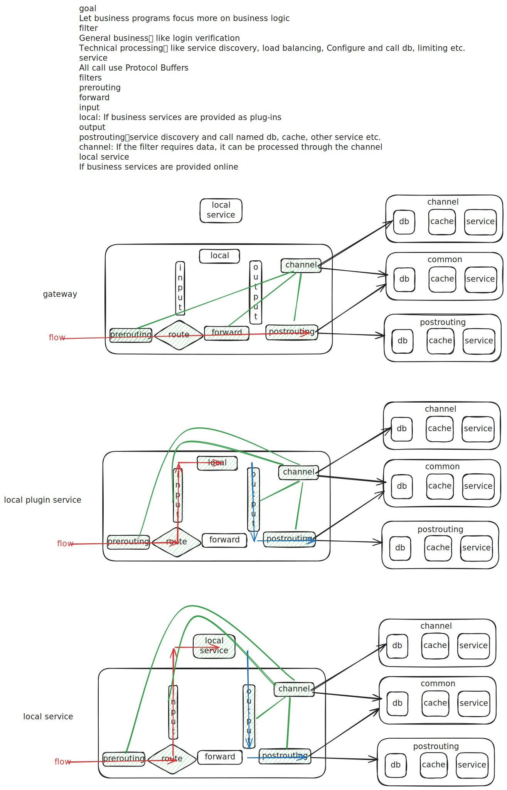

### RUN
The sample configuration file required for application startup is placed in ${workspaceFolder}/servicefilter-main/src/service-filter-default.yaml .
Start app cmd: cargo run -- -c servicefilter-main/src/service-filter-default.yaml
If you use vscod to debug the application, .vscode/launch.json already configured

### Dependencies

In order to build, you need the `protoc` Protocol Buffers compiler, along with Protocol Buffers resource files.

#### Ubuntu

```bash
sudo apt update && sudo apt upgrade -y
sudo apt install -y protobuf-compiler libprotobuf-dev
```

#### Alpine Linux

```sh
sudo apk add protoc protobuf-dev
```

#### macOS

Assuming [Homebrew](https://brew.sh/) is already installed. (If not, see instructions for installing Homebrew on [the Homebrew website](https://brew.sh/).)

```zsh
brew install protobuf
```

#### Windows

- Download the latest version of `protoc-xx.y-win64.zip` from [HERE](https://github.com/protocolbuffers/protobuf/releases/latest)
- Extract the file `bin\protoc.exe` and put it somewhere in the `PATH`
- Verify installation by opening a command prompt and enter `protoc --version`
